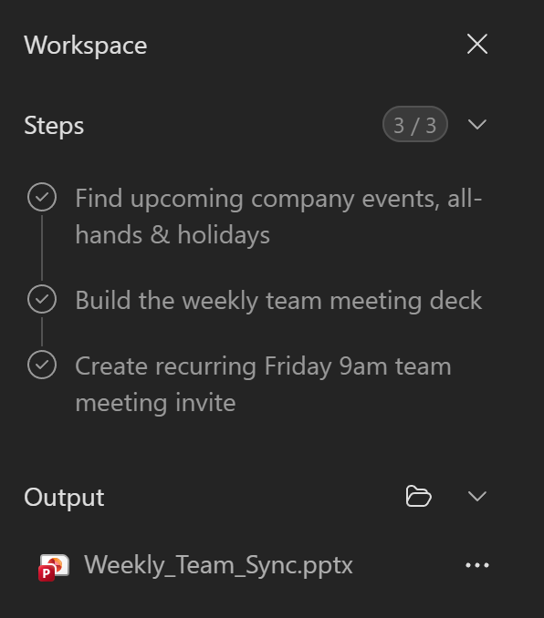
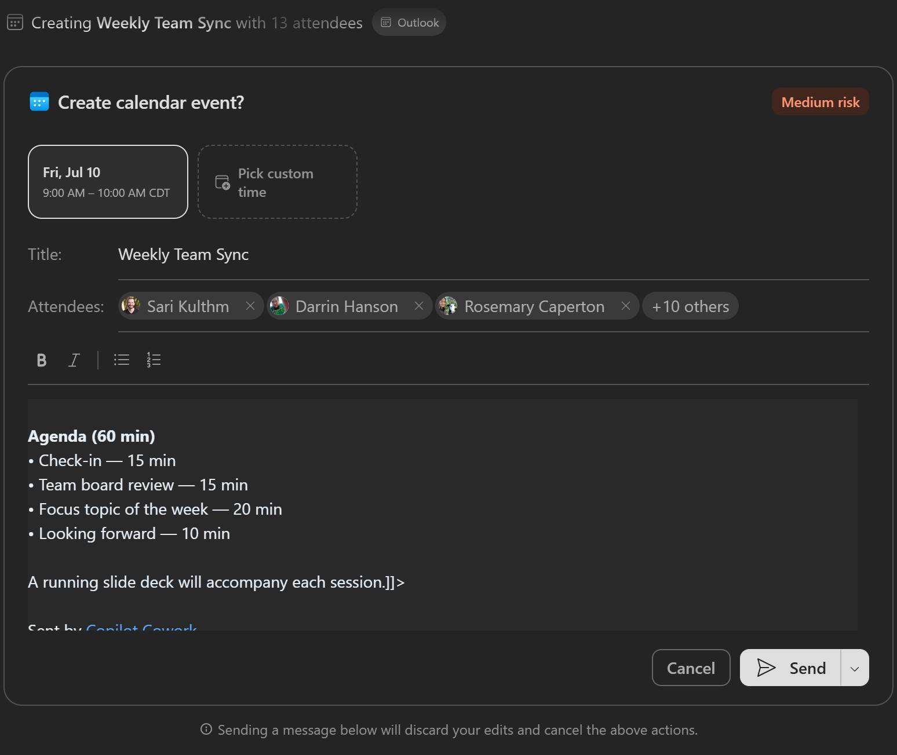
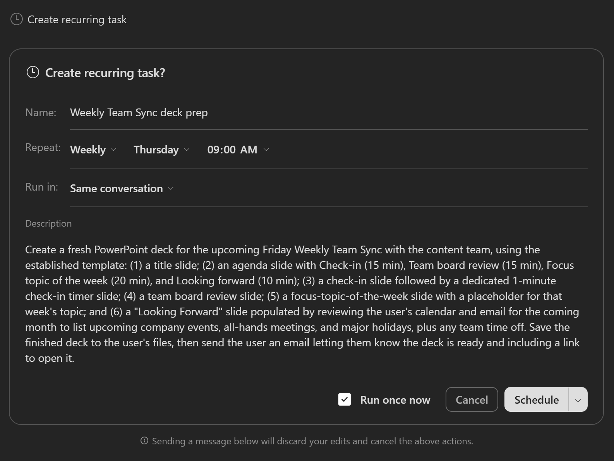
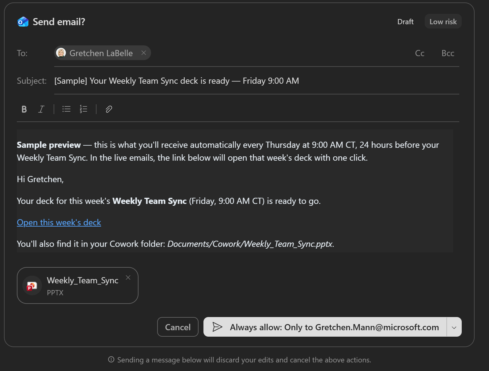
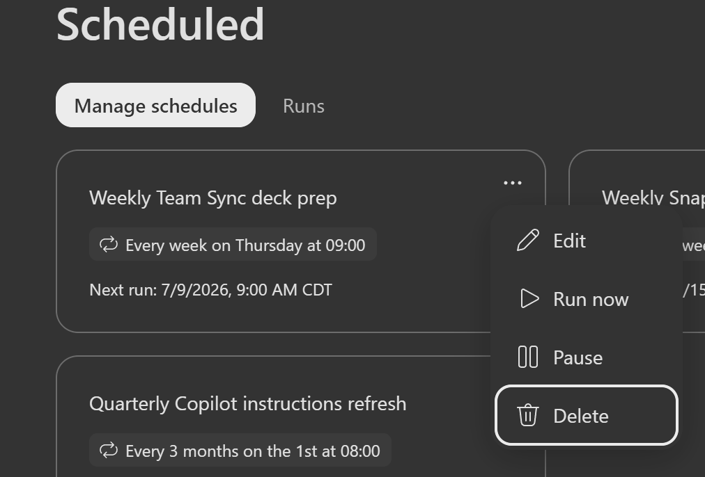

# ✈️ Pre-Flight: Orientation Through Discovery

**Welcome aboard.** This is your pre-flight check: get familiar with Copilot Cowork, find where your skills and controls live, and run your first task - turning a data file into a visual board of open and completed work.

Cowork does the heavy lifting, but you stay in the captain's seat - it checks in for your approval before it acts.

## What You'll Produce {#what-youll-produce}

By the end of this flight, Copilot Cowork will have:

- ✅ Draft a meeting agenda
- ✅ Create a team meeting deck
- ✅ Schedule a team meeting
- ✅ Automate the weekly deck building

## The Scenario {#the-scenario}

You run a weekly team meeting, but every week it's the same overhead: pulling together an agenda, building a slide deck, finding a time that works, and sending the invite. Instead of doing it all manually, you'll hand the whole workflow to Copilot Cowork — from drafting the agenda to scheduling the meeting and automating the deck so it rebuilds itself each week.

You'll use a sample team roster so everyone gets a predictable result, but you can swap in your own team context anytime to make it immediately relevant.

## Exercise 1.1 - Find Your Way Around {#exercise1-find-your-way-around}

Before you run anything, learn where the important surfaces live.

1. Open [Microsoft 365 Copilot](https://m365.cloud.microsoft/chat/)

1. Select **Cowork**.

    

    You'll land on the Copilot Cowork homepage. From here you can type a new task in the prompt window, try one of the pre-built task samples, or pick up where you left off from the recent tasks list.

    

    > [!NOTE]
    > Your Copilot Cowork homepage may look slightly different depending on when you access it.

1. In the prompt area, select **+** and note the three ways to add context:

    - **Add work context** - reference files, people, emails, and Teams chats from your organization
    - **Upload images and files** - browse your device
    - **Attach cloud files** - pick from OneDrive, SharePoint, or Teams

1. Look at the **left navigation** under the Cowork tab. This is how you move between your work:

    

    - **New task** - start a fresh task in a clean conversation
    - **My tasks** - return to tasks you've already run
    - **Scheduled** - Review & set up prompts to run automatically on a recurring schedule
    - **Customize** - manage your plugins and skills, including any custom skills you add

1. Select **Customize** and then select the **Skills** tab. Browse through the **built-in skills**. These are the skills Cowork can draw on automatically - you don't have to call them by name. Notice skills like **html**, **Communications**, and **Documents**, which you'll see in action shortly.

    

> [!TIP]
> You don't pick skills manually. Cowork loads the right ones on demand based on what you ask - you'll watch this happen in the next exercise.

## Exercise 1.2 - Run Your First Task {#exercise2-run-first-task}

Now put it together. You'll hand Cowork a complete brief for your weekly team meeting — the agenda, the deck setup, and the calendar invite — and watch it execute the whole workflow, checking in for your approval as it acts.

> [!NOTE]
> Cowork adapts to the context it has, so it won't behave identically for everyone. Depending on what it already knows - or what permissions are already set up - it may or may not open an action window or ask a clarifying question before it runs. If your experience doesn't match the steps exactly, that's expected, not a mistake.

1. In the Cowork prompt area, paste the following:

    ```text
    I'd like to set up a new weekly cadence with my team. Here is the agenda:
    - Check-in — 15 minutes
    - Team board review — 15 minutes
    - Focus topic of the week — 20 minutes
    - Looking forward — 10 minutes

    Set up a weekly team meeting deck — for check-in I would like a timer slide
    of 1 minute. For the looking forward topic, look at my calendar and emails
    over the next month and list the company events, all-hands meetings, and
    major holidays.

    Create a weekly team meeting invite on Fridays at 9 AM that includes the agenda.
    ```

    > [!TIP]
    > **Want to make it real?** Instead of this agenda, point Cowork at your existing agenda or meeting documents. Use **+** → **Add work context** to reference them. You can also attach an existing PowerPoint and ask Cowork to model the style and colors. The steps are the same - just expect different results.

1. Send the prompt by hitting the white circle with the black arrow pointing up in the bottom-right corner.

1. As Cowork works, watch it **think out loud**. It shows a step-by-step progress log, the skills it loads, and the files it produces. Call out what you see:

    - Which **skills** activate (for example, a Documents skill, then a Calendar Management skill)
    - Which files appear in the **output** for you to download or preview
    - Any **references** it used from your work context

        

    > [!NOTE]
    > The **thinking indicator** lets you know when Cowork is breaking your request into steps and working through them, narrating as it goes. Behind it is [Work IQ](https://learn.microsoft.com/en-us/microsoft-365/copilot/extensibility/work-iq), the intelligence layer that reasons across your emails, meetings, files, chats, and calendar to find what's relevant, within your organization's permissions.
    >
    > 

1. Cowork selects people for the meeting invite who directly report to you. Prior to sending the weekly meeting request, Cowork checks with you to ensure you approve of the contents before it sends. Click **Cancel** or remove the attendees if you would like to test the send. Continue to skip prompts and Cowork will move onto the next task.

    

1. Preview the PowerPoint presentation to see the degree to which it is acceptable for your meeting needs. You can continue to prompt Cowork to make changes to the PowerPoint to your satisfaction.

## Exercise 1.3 - Automate Your Weekly Team Meeting Prep {#exercise3-automate-weekly-prep}

Now that you have a deck you're happy with, tell Cowork to rebuild it automatically each week so you never start from scratch.

1. Prompt Cowork to make this deck a weekly creation. Paste the following:

    ```text
    This looks good. Create a new deck 24 hours prior to my weekly team meeting.
    Send me a link to the deck via Email letting me know it is ready.
    Send me a sample now of what that Email will look like.
    ```

1. Cowork will confirm the design of the newly scheduled task. Choose if you want it to run as a new conversation each week or append to the same conversation before you schedule it.

    

1. Click **Schedule**. Cowork will prompt you with the Email asking for permission to send. Click **Always Allow** or **Approve Once** if you would like to move forward and have it send the Email. Otherwise click **Cancel**.

    

1. To cancel the automation you created during this exercise, navigate to **Scheduled** on the top left and select the **Weekly Team Sync deck prep**. Using the ellipses (**...**) on the top right of the box, drop down and select **Delete**.

    > [!TIP]
    > You can also just tell Cowork in the conversation you would like to cancel the automation.

    

## What Done Looks Like {#what-done-looks-like}

A successful run looks like:

- A meeting agenda was drafted and included in the calendar invite
- A PowerPoint deck was created with slides for each agenda topic
- A weekly team meeting was scheduled with your direct reports
- A recurring automation was set up to rebuild the deck 24 hours before each meeting
- You received (or previewed) an email notification with a link to the deck

Quick debrief:

- What did Cowork get right on the first try?
- What would you change about the deck or agenda for your real team?
- How would you describe the approval experience to a colleague?

## Pre-Flight Complete {#pre-flight-complete}

You found your way around Copilot Cowork, delegated a full team meeting setup, and automated weekly deck prep — all from a single conversation.

What you saw in action:

✅ **Multi-step delegation**: You described the outcome and Cowork handled the agenda, deck, and invite end to end.

✅ **Approval at every step**: Cowork checked in before sending invites and emails — you stayed in control.

✅ **Automation built in**: One prompt turned a one-time task into a recurring weekly workflow.
